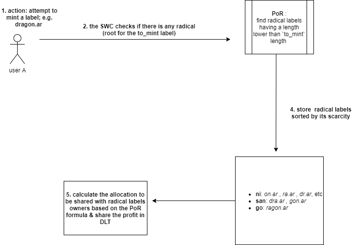
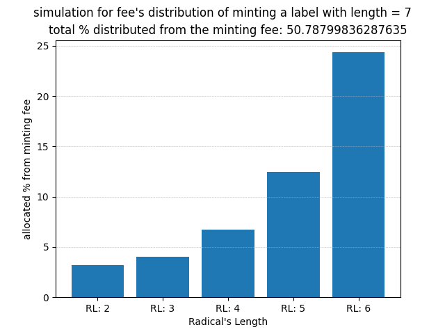

# Profit Sharing (incentives) of ANS
The current documentation details how the ANS protocol incentivizes owners of labels.

## Motivation
Wallet address resolvers and decentralized identifiers have improved the user experience of web3 and made it easy to interact with the network with a web2-like UX.

Additionally, labels (aka address resolvers) can also be bought for financial benefits (re-selling) or social spectulation. The ANS protocol solves a lack of incentives beyond these use cases by making ANS labels "Liquid Digital Property". 

ANS incentivizes label owners through a mechanism called Proof of Radical (PoR).

## Terminology
- label: an ANS username (e.g. `gon.ar`).
- radical: inspired by the [grammatical classifier](https://en.wikipedia.org/wiki/Radical_(Chinese_characters)), a radical is any minted label that can be a radical (base) for a to-mint label; e.g. `gon.ar` (already minted) can be a radical for `dragon.ar` (not minted).
- minting fee: a pre-determined value inside the ANS contract that indicates the minting cost for each label based on its length scarcity.
- profit-sharing: a mechanism invented by the Arweave community to monetize a DAO (Profit Sharing Community) for its members
- RL: Radical Label(s)

The ANS protocol implements the first in-contract profit-sharing mechanism. 

## How it works

### workflow:

### PoR:

- Profit-sharing percentage is calculated on every minting attempt for labels between 3 and 7 characters in length (san to shichi scarcity).
- Beneficiaries are any user that owns one or more label between 2 to 6 characters in length (ni to roku scarcity).
- The profit-sharing percentage is set for every label type (scarcity). If there are multiple radicals for the same label type, then the allocated percentage of the label type is distributed on pro-rata basis amongst the same RL scarcity owners.
- The PoR shares profit only with minted RL with a character length lower than the `to_mint` length ( `radical.length < to_mint.length ` ).
- The distributed percentage is deducted from the pre-defined minting fee.
- The percentage of profit-sharing allocation is inversely proportional to the `to_mint` label character length.

The profit-sharing percentage is calculated according to the following formula:

The formula computes the calculation for the `to_mint` label against every label with a character length not equal and lower than its length. The `a` variable in the formula stands for `to_mint.length`,  and `b` for `radical.length`.

### Simulation

The following diagrams visualize the calculation of profit-sharing percentage for radical's length as per the length of the `to_mint` label.

You can find the full test [here](./img) . Notice how a RL with a character length of 2 shares the lower allocation because its frequency as a radical will be the highest, while the RL with a character length of 6 shares the highest allocation.

## Cashback
The current PoR's model does not exclude self-owned radicals while calculating profit sharing at new label `mint` event. Thus, owners can also get a "cashback" for minting a new label with an pre-minting self-owned radical.

## License

The project is licensed under the MIT license.

