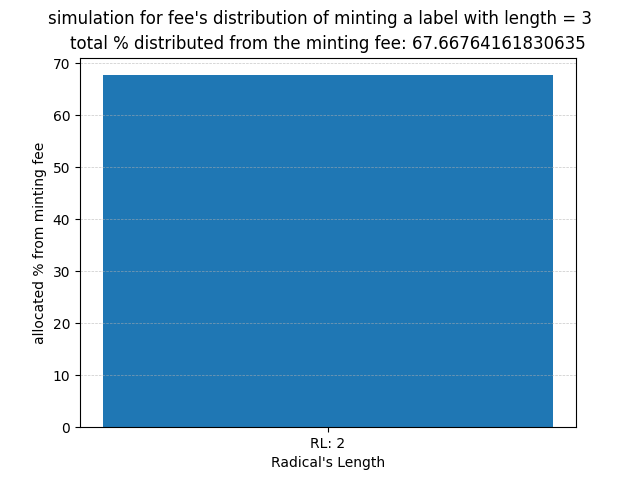

# Profit Sharing (incentives) of ANS
The current documentation elights how the ANS protocol incentives the labels owners

## Motivation
Wallet addresses resolvers and decentralized identifiers have improved the Web3 user experience and make it easy to interact with the network in a Web2-like UX.

Besides that, labels (aka addresses resolvers) are also bought for financial benefits (re-selling) or social spectulations. The ANS protocol solves the lack of incentives by giving the ANS labels the functionality of Liquid Digital Property. 

The ANS incentives label owners through a mechanism called Proof of Radical (PoR)

## Terminology
- label: an ANS username (e.g. `gon.ar`)
- radical: inspired from the grammar terminology. It can be any minted label that can be a radical (base) for a to-mint label ; e.g. `gon.ar` (already minted) can be a radical for `dragon.ar` (not minted).
- minting fee: a pre-determined value inside the ANS contract that indicates the minting cost for each label based on its length scarcity
- profit sharing: a mechanism invented by the Arweave community to monetize a DAO (Profit Sharing Community) members
- RL: Radical Label(s)

the ANS protocol implements the first in-contract profit sharing.

## How it works

### workflow:

### PoR:

- Profit sharing percentage is calculated on every minting attempts of labels having length from 3 to 7 (san to shichi scarcity).
- Beneficiaries are any user that owns one or more label having a length from 2 to 6 (ni to roku scarcity).
- The profit sharing percentage is set for every label type (scarcity). If there are multiple radical for the same label type, then the allocated percentage of the label type is distributed on pro-rata basis amongst the same RL scarcity owners
- The PoR shares profit only with minted RL having a length lower than the `to_mint` length ( `radical.length < to_mint.length ` )
- The distributed percentage is deducted from the pre-defined minting fee
- Profit sharing percentage's  allocation is inversely proportional with the `to_mint` label length

The profit sharing percentage is calculated according to the following formula:

The formula computes the calculation for `to_mint` label on every label having a length not equal and lower than its length. The `a` variable in the formula stands for `to_mint.length` ,  and `b` for `radical.length` .

### Simulation

The following diagrams visualise the calculation of profit sharing percentage for radical's length per `to_mint` length

You can find the full test [here](./img) . You can notice how RL having length 2 shares the lower allocation because its frequency as radical will be the highest, while RL having length 6 shares the highest allocation.

## License

The project is licensed under the MIT license

